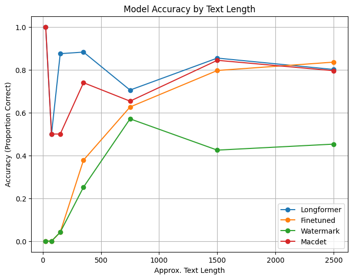

# MACDET
A binary machine generated text detection framework.
## Results
We evaluated our models on various testbeds and achieved the following results:

### Model Accuracy by Testbed


### Additional Results


- [MAGE](#mage)
  - [Testbeds](#testbeds)
- [Models](#models)
    - [Finetuned models](#finetuned-models)
    - [Pretrained models](#pretrained-models)


## How to run
```bash
poetry install
poetry run uvicorn backend.main:app
```

## MAGE
### Testbeds
For the testbeds you need to download the testbeds from the [drive link](https://drive.google.com/file/d/1chbinwnrXxTA2pqzzbadS62wYjIgw0Ue/view?usp=sharing), unzip it and place it under the `backend/data/mage/`.  

## Models
### Finetuned models
The finetuned models from different families for different languages are available at the [drive link](https://drive.google.com/drive/folders/11dOv7iC7iEn3Bxj14bAt8iLxa4XV-KnZ?usp=sharing), you should download the ones you prefer and place them under the `/models/` folder. Note that `models` and `backend` are at the same level. You mıght also want to change the `model_dirs` inside the code.
